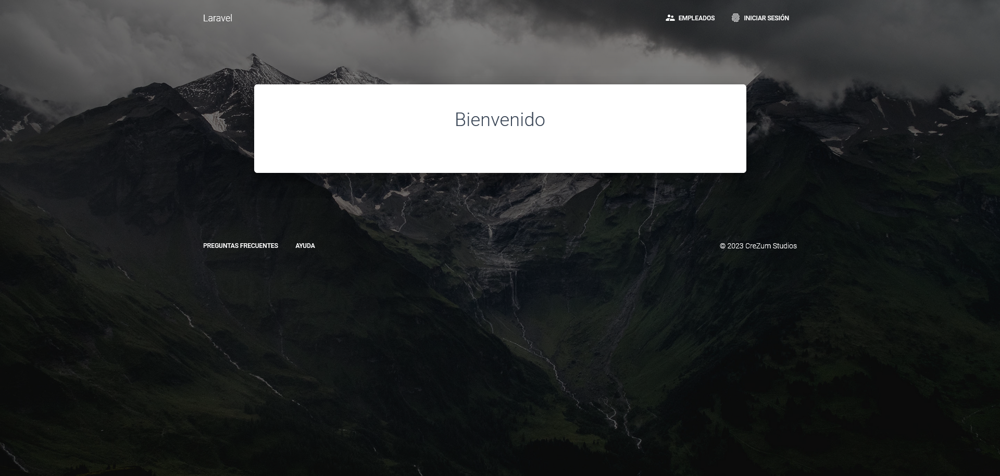
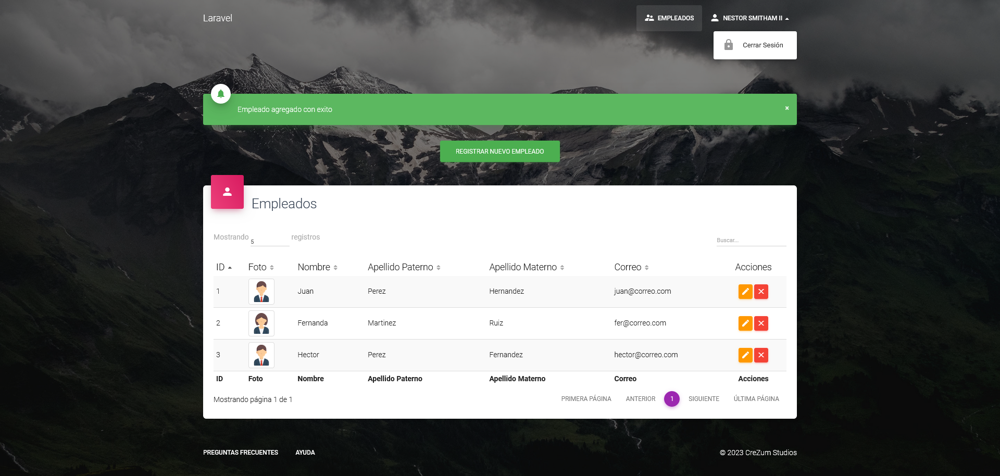
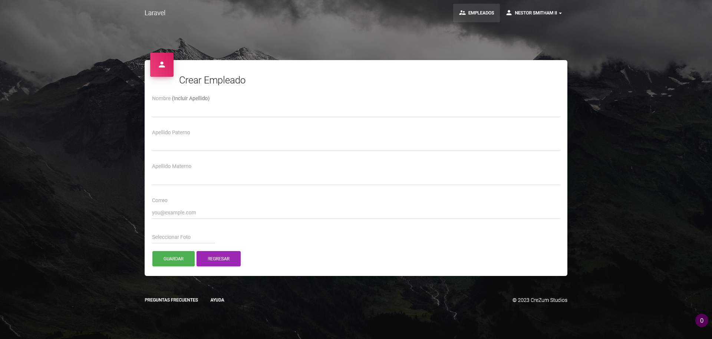

# CRUD Laravel 8 With Material Dashboard
This project has been created to show an example of how to create a basic CRUD with Laravel 8.

## Usage
Clone this repository and place it in the htdocs directory.
Open Xampp and run Apache and MySQL.
Open a terminal on project directory and run:

    npm install
    php artisan migrate:fresh --seed
    php artisan storage:link
    
Open your browser and go to a link like this: http://localhost/crudlaravel8/public/

### Credentials:
Email: Any mail generated by the seeds (you can get some in the users table).
Password: password

## Featured
 - [Laravel 8](https://laravel.com/docs/8.x)
 - [Material Dashboard PRO - V1.1.0](https://www.creative-tim.com/)
 - [XAMPP](https://www.apachefriends.org/es/index.html)
 - [NPM](https://nodejs.org/es)

## Preview

